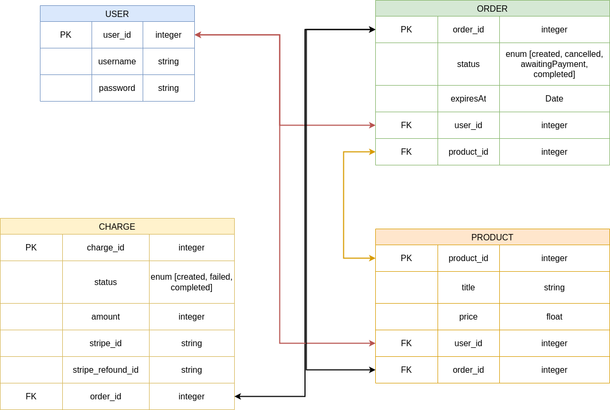

# ESHOP in microservices

This is an example of how can we build an eshop in microservices. Microservices have many advantages over monolithic architectures. Some advantages of microservices architecture are Scalability, improved Fault Isolation, Program Language Agnostic etc.

# Build With

All services written in 

# Database Schema

Use 2 Databases MongoDB & PostgreSQL

# Application Architecture

if you want to make changes read  below

# TODO LIST

1) Repository
    - [x] add [snyk](https://snyk.io/)
2) Tickets
    - [ ] create jenkins pipeline for the repository (docker)
3) Jenkins Pipeline for infrastructure
    - [ ] create eks (3 nodes) with Terraform and/or aws cdk
    - [ ] use AgroCD for deploy containers in Kubernetes
4) Then go to Order Service
5) Create frontend for next.js

Conclusion view tutorial for jenkins
    

# Documentation
